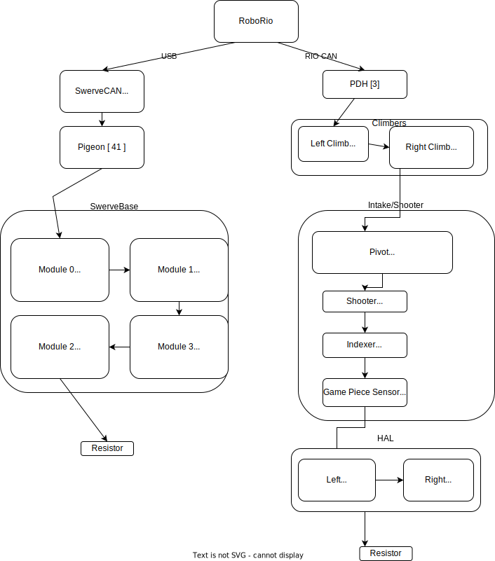

**FRC 5290 - VIKotics**

---

# Robot Subsystems

Robot code that interacts with the various electrical and mechanical devices
that are used to implement robot mechanisms are organized into
[subsystems](https://docs.wpilib.org/en/stable/docs/software/commandbased/subsystems.html)
that are accessed by higher-level commands and routines.  A few of these are
documented here.

## [Climber Subsystem](./climber/)

The Climber Subsystem controls the extension and retraction of the portions of
the robot arm used for climbing.  This subsystem employs two SRX motor controllers
that drive CIM motors connected to the elevator mechanism.

## [Dashboard Subsystem](./dashboard/)

The Dashboard Subsystem exists to simplify the process of adding dashboard tabs
to parts of the robot code.  A single instance of the `DashboardSubsystem` can
be created in the robot (e.g. in the `RobotContainer` class).  Once this is
done, a new dashboard tab can be created for a subsystem simply by creating a
class that extends [`IDashboardTab`](../../lib/dashboard/IDashboardTab.java) and passing
it to `DashboardSubsystem.add()`.  This will cause the new tab to be added to
the list of Dashboard tabs managed by the subsystem.

When the `initialize()` method is called on the instance of `DashboardSubsystem`,
(usually from the [`robotInit()` method in `Robot.java`](../Robot.java), each
dashboard registered using `add()` will have its `initDashboard()` method called.
After the robot is initialized, the `updateDashboard()` method of each
registered tab gets called during each robot periodic cycle, allowing them to
put or get data from NetworkTables entries if necessary.

## [HAL (Laser Proximity Sensor) Subsystem](./HAL/)

The HAL subsystem manages laser proximity sensors used to detect proximity of a
nearby robot.

## [LED Subsystem](./LEDs/)

The [`LEDSubsystem` class](LEDs/LEDSubsystem.java) manages one or more
strips of addressable LEDs.  It sets the color of LEDs when disconnected from the
Driver Station and when the robot is Disabled.  Additionally, it exposes methods
that can be used to obtain handles to LED strips on the left and right side of
the robot.  These handles can be used by Commands that implement LED patterns or
solid colors.

## [Pivot Subsystem](./pivot/)

The [`PivotSubsystem`](./Pivot/ShooterPivotSubsystem.java) class
manages a pair of Falcon 500 motors used to pivot the robot arm mechanism.  It configures
closed-loop [Motion Magic](https://pro.docs.ctr-electronics.com/en/latest/docs/api-reference/device-specific/talonfx/motion-magic.html) control of motor position to supply smooth movement of the pivot mechanism.

## [Swerve Drive Subsystem](./swerveCTRE/)

A [`CommandSwerveDrivetrain`](./swerveCTRE/CommandSwerveDrivetrain.java) class provides a subsystem that
interfaces with Kraken motors and CTRE CANcoders used to drive four
[Swerve Drive Specialties SDS Mk4i](https://www.swervedrivespecialties.com/products/mk4i-swerve-module)
swerve drive modules.

## [Joystick Subsystem](./JoystickSubsystem.java)

The Joystick subsystem manages up to two Xbox controllers for use in the robot.
Controller buttons are mapped to robot [commands](../commands/commands.md) in
the `configureButtonBindings()` method using typical methods of the WPILib
`Trigger` class (e.g. `OnTrue`, `WhileTrue`, etc.).  Two-button combinations can
be configured using the `setupButtonCombo()` method, allowing an operator to
use buttons for multiple functions or variations of functionality.

The subsystem base class implements deadbanding and sensitivity adjustment of
joysticks and non-binary joystick axes to ensure a reliable experience for
drivers and operators with older, well-used controllers.

## CAN IDs

